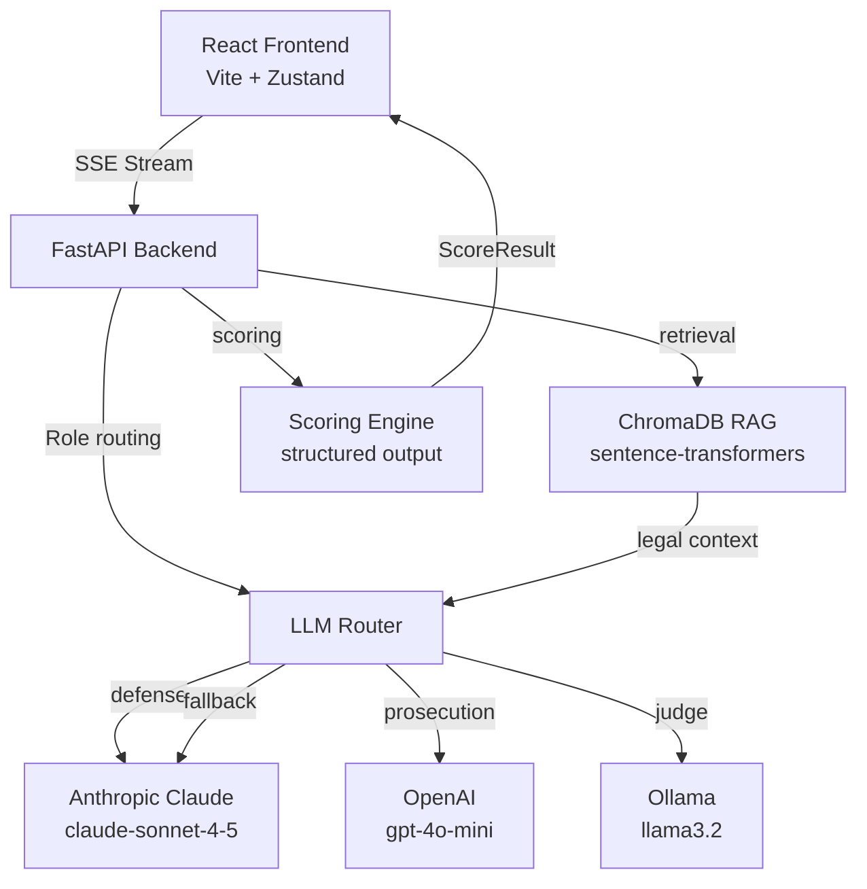

<div align="center">

# ⚖️ LexAI

### AI Courtroom Simulator

[](https://python.org)
[](https://fastapi.tiangolo.com)
[](https://react.dev)
[](https://typescriptlang.org)
[](https://tailwindcss.com)
[](https://langchain.com)
[](https://trychroma.com)
[](https://anthropic.com)
[](https://openai.com)
[](https://ollama.com)
[](LICENSE)

*Multi-LLM courtroom simulation with RAG-powered legal arguments, real-time scoring, and AI judges*

</div>

---

## 🏛️ Overview

LexAI is an interactive Greek courtroom simulator powered by multiple large language models. Each legal role — defense attorney, prosecutor, judge, and witness — is assigned a dedicated LLM with automatic fallback routing. Arguments are grounded in Greek law via a ChromaDB RAG pipeline, scored in real-time, and streamed live to the frontend.

You can play as the defense attorney yourself, or sit back and watch AI vs AI unfold.

---

## 🔧 Tech Stack

| Component | Technology |
|-----------|------------|
| Frontend | React 19, TypeScript, Vite, Tailwind CSS v4 |
| State | Zustand |
| Routing (frontend) | React Router DOM v7 |
| Backend | FastAPI, Python 3.11 |
| LLM Orchestration | LangChain 0.3 |
| LLM Providers | Anthropic Claude, OpenAI GPT-4o-mini, Ollama |
| Vector Store | ChromaDB + sentence-transformers |
| Streaming | Server-Sent Events (SSE) |
| Rate Limiting | SlowAPI |
| Containerization | Docker + Docker Compose |

---

## ✨ Features

- ⚖️ **Multi-role courtroom** — Defense, Prosecution, Judge, Witness each powered by different LLMs
- 🔀 **Automatic fallback chains** — If a provider fails, the chain falls back seamlessly
- 📚 **RAG legal context** — Greek law excerpts retrieved via ChromaDB, injected into every argument
- ⚡ **SSE streaming** — Arguments stream token by token, courtroom-style
- 🧠 **LLM-as-judge scoring** — Each argument scored 0–10 with structured output (no JSON parsing)
- 🎮 **Two modes** — Play as defense or watch AI vs AI
- 🏛️ **Authentic Greek UI** — All interface text in Greek, Cinzel + Source Serif 4 typography

---

## 🏗️ Architecture



---

## 🚀 Quick Start

### Prerequisites

- Python 3.11+
- Node.js 20+
- Anthropic API key and/or OpenAI API key

### With Docker

```bash
git clone https://github.com/GiorgosPanagopoulos/lexai
cd lexai

cp backend/.env.example backend/.env
# Edit backend/.env with your API keys

docker compose up --build
```

- Frontend: http://localhost:5173
- Backend: http://localhost:8000

### Manual Setup

**Backend:**
```bash
cd backend
python -m venv venv
source venv/bin/activate   # Windows: venv\Scripts\activate
pip install -r requirements.txt
cp .env.example .env       # fill in your API keys
uvicorn backend.main:app --reload --host 0.0.0.0 --port 8000
```

**Frontend:**
```bash
cd frontend
npm install
npm run dev
```

---

## 🎮 Usage

### Game Modes

**Υπεράσπιση (Παίξε)** — You play as the defense attorney. Type your arguments in Greek, the Prosecution and Judge respond automatically via AI.

**Παρατήρηση AI vs AI** — Watch Defense, Prosecution, and Judge debate autonomously. Pure AI courtroom drama.

### Requesting a Verdict

After each side has argued at least 3 times, the "Αίτημα Ετυμηγορίας" button activates. The Judge LLM reviews the full transcript and delivers a structured verdict: GUILTY or NOT GUILTY.

---

## 🗺️ Roadmap

- [ ] Multiplayer mode (2 users argue opposing sides)
- [ ] More case scenarios across different legal domains
- [ ] Full Greek law RAG with real Hellenic legal texts
- [ ] Appeal system (second trial with new evidence)
- [ ] Voice input for arguments

---

<div align="center">

*I build things I'd trust with something that matters.*

⚡ Built by — **Georgios Panagopoulos** — Full-Stack Developer

[](https://github.com/GiorgosPanagopoulos)
[](https://linkedin.com/in/georgios-panagopoulos-9253842ba)

☕ Powered by mass amounts of caffeine & mass amounts of curiosity.

</div>
